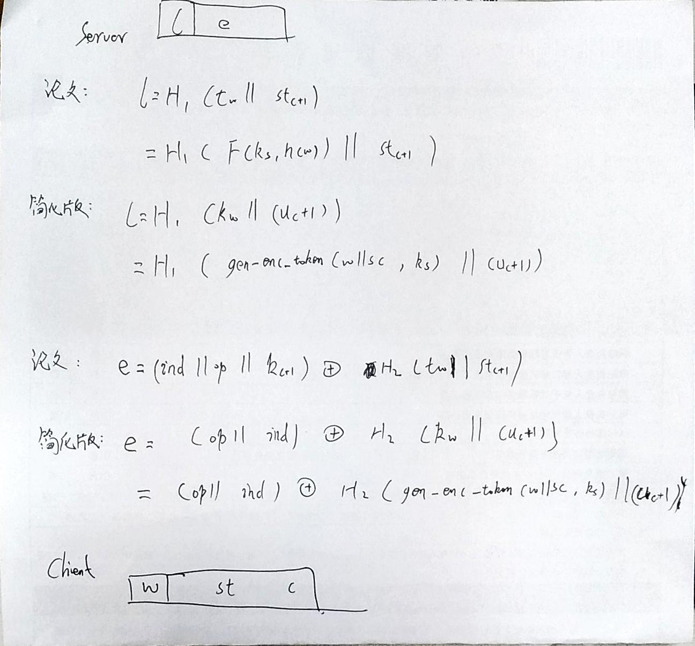

# 作者的简化



# 功能测试
## 服务器
```bash
# 数据库的路径 缓存数据的路径 线程数
./rpc_server /tmp/fast.sdb /tmp/fast.scadb 1 benchmark_server.out
```
## 客户端
```bash
# 更新1个keyword-filename对
./rpc_client /tmp/fast.cdb 1

# 更新3个keyword-filename对
./rpc_client /tmp/fast.cdb 2

# 查询
./rpc_client /tmp/fast.cdb 3
```

# 产生随机数据库

直接插入数据库中，不包含RPC通信延迟
```bash
./random_db /etc/random.sdb 100
```

# 正式测试
## Update
```bash
# 数据库的路径、实体数、关键词、flag、线程数
./rpc_client /tmp/fast.cdb 100 keyword_10e2 2 1 benchmark_client_10e2.update.out
./rpc_client /tmp/fast.cdb 1000 keyword_10e3 2 1 benchmark_client_10e3.update.out
./rpc_client /tmp/fast.cdb 10000 keyword_10e4 2 1 benchmark_client_10e4.update.out
./rpc_client /tmp/fast.cdb 100000 keyword_10e5 2 1 benchmark_client_10e5.update.out
```
## Search
```bash
# 数据库的路径、实体数、关键词、flag、线程数
./rpc_client /tmp/cdb.db 4 keyword_10e2 3 1 benchmark_client_10e2.search.out
./rpc_client /tmp/cdb.db 4 keyword_10e3 3 1 benchmark_client_10e3.search.out
./rpc_client /tmp/cdb.db 4 keyword_10e4 3 1 benchmark_client_10e4.search.out
./rpc_client /tmp/cdb.db 4 keyword_10e5 3 1 benchmark_client_10e5.search.out
```
# 核心代码
```cplusplus
gen_update_token(){
    uc = get_update_time(w);
    tw = gen_enc_token(w);
    l = H1(tw+(uc+1));
    e = XOR((op+ind),H2(tw+(uc+1)))
}
gen_search_token(){
    uc = get_update_time(w);
    tw = gen_enc_token(w);
    kw = gen_enc_token(tw+uc);
}
```
# 使用脚本

测试update的时间
```bash
sh ./scripts/update_batch.sh
sh ./scripts/update_out.sh
```

测试search的时间
```bash
sh ./scripts/search_batch.sh
sh ./scripts/search_out.sh
```